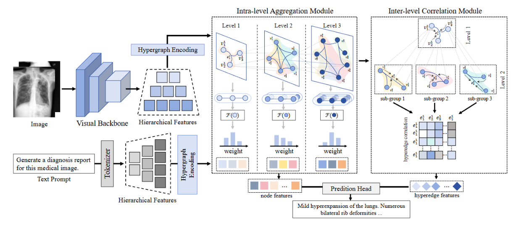
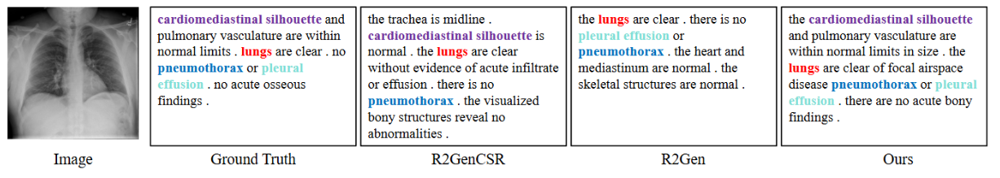
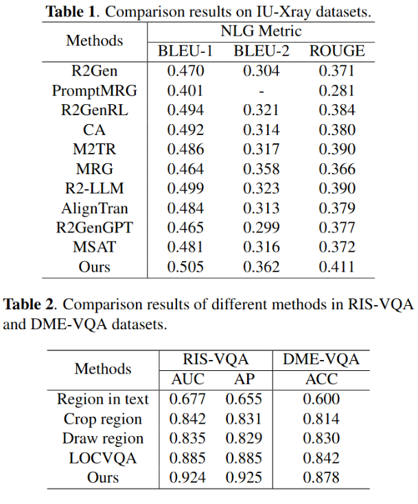

# Exploring Intrinsic Hierarchical Organization for Medical Diagnosis

This is the implementation of Exploring Intrinsic Hierarchical Organization for Medical Diagnosis at ISBI.

We propose a structured knowledge-driven framework that explores intrinsic hierarchical organization to represent high-order dependencies within and across biological scales for interpretable diagnosis. Our approach is motivated by the inherent hierarchical structure of biological systems, where complex physiological functions arise from interactions across multiple organizational levels, including intra-level interactions and inter-level relationships. By integrating them into a unified hypergraph representation, we derive interpretable features that preserve structural dependencies across scales and offer a natural scaffold to integrate heterogeneous medical data in a unified, structured way. Each layer first models group-wise interactions through the hyperedges within the hypergraph, and then fuses information along the bidirectional path formed by the connections between different scales throughout the entire hierarchical structure. In this way, local and hierarchical information can interweave and complement each other. Probabilistic inference over the hypergraph space allows us to uncover latent hierarchical patterns that are predictive of disease states while remaining aligned with biological plausibility. Experimental results on medical report generation and medicalVQA tasks demonstrate improved diagnostic accuracy, suggesting that modeling biological data through hierarchy-based structures offers a principled path for medical diagnosis. 

## Requirements

- `torch==1.7.1`
- `torchvision==0.8.2`
- `opencv-python==4.4.0.42`

## Datasets
We use two datasets (IU X-Ray and MIMIC-CXR) in our paper.

For `IU X-Ray`, you can download the dataset from [here](https://drive.google.com/file/d/1c0BXEuDy8Cmm2jfN0YYGkQxFZd2ZIoLg/view?usp=sharing) and then put the files in `data/iu_xray`.

NOTE: The `IU X-Ray` dataset is of small size, and thus the variance of the results is large.

## Train

Run `python main_train_exam.py` to train a model on the IU X-Ray data.

## Test

Run `python main_test.py` to test a model on the IU X-Ray data.

Follow [CheXpert](https://github.com/MIT-LCP/mimic-cxr/tree/master/txt/chexpert) or [CheXbert](https://github.com/stanfordmlgroup/CheXbert) to extract the labels and then run `python compute_ce.py`. Note that there are several steps that might accumulate the errors for the computation, e.g., the labelling error and the label conversion. We refer the readers to those new metrics, e.g., [RadGraph](https://github.com/jbdel/rrg_emnlp) and [RadCliQ](https://github.com/rajpurkarlab/CXR-Report-Metric).

## Visualization

Run `python main_plot.py` to visualize the attention maps on the MIMIC-CXR data.

## Result

## Acknowledgements
The evaluation code (cmc & mAP) is partially borrowed from the [MARS-evaluation](https://github.com/liangzheng06/MARS-evaluation) repository. 

The implementation relies on [R2Gen](https://github.com/cuhksz-nlp/R2Gen). We thank the original authors for their work and open source code.

## Contact
Should you have any question, please contact chengzhicao88@gmail.com.

